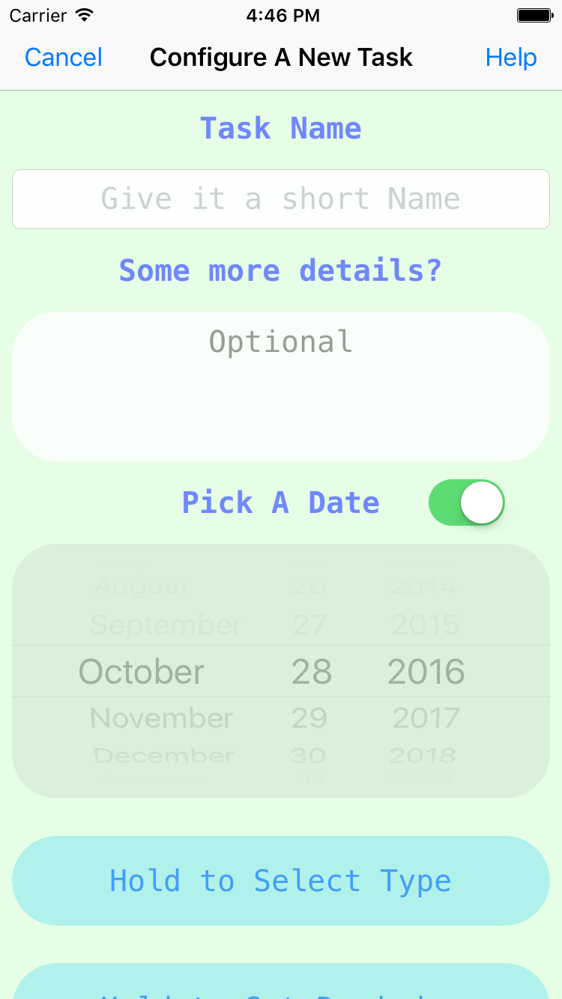
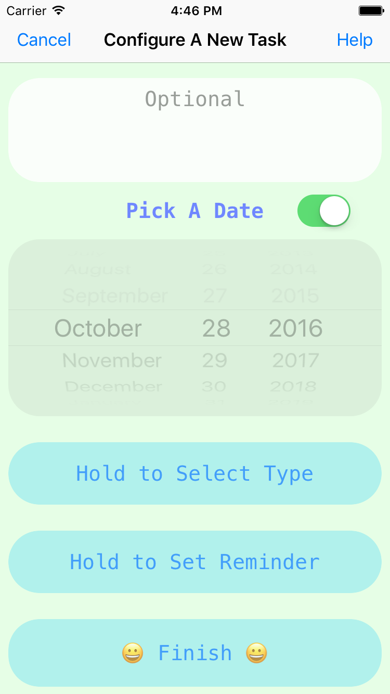
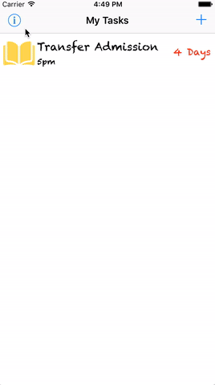
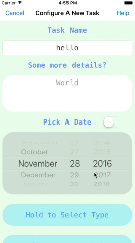
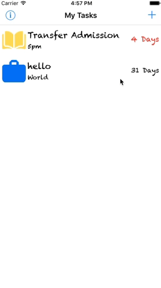

# Task
### A simple task managing app built with Core Data and UserNotification
### Screenshot
***Main View***  
  
***Add A Task***  
  
  
### Some Gifs
- #### Main View Navigation
- 
- #### Adding a New Task
- 
- #### Delete Tasks
- 

### Todo
- add license
- add screenshot of the app(or gifs)
- make an app icon
- add more content to README

### License
- MIT
