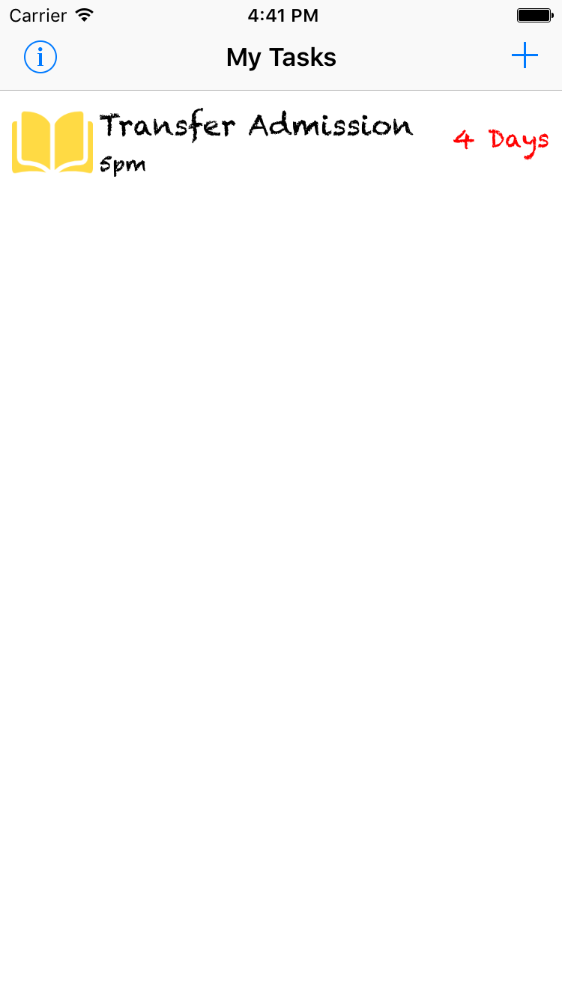

# Task
### A simple task managing app built with Core Data and UserNotification
---
### Screenshot
***Main View***

***Add A Task***

---
### Some Gifs
- #### Main View Navigation

- #### Adding a New Task

- #### Delete Tasks

---
### Todo
- add license
- add screenshot of the app(or gifs)
- make an app icon
- add more content to README
---
### License
- MIT
