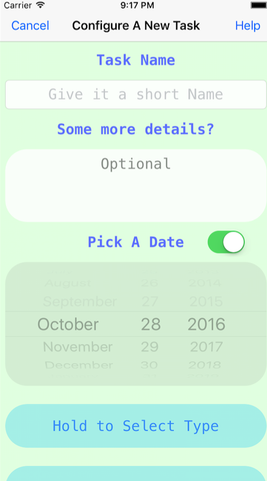
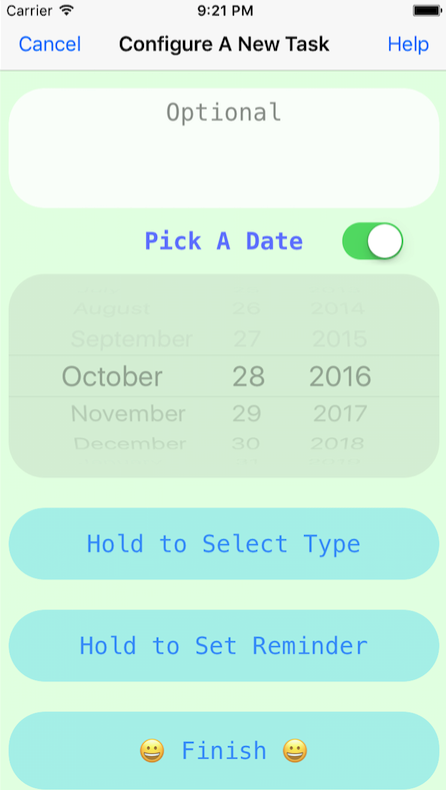

# Task
### A simple task managing app built with Core Data and UserNotification  
### Screenshots  
### Main View  
  
### Add A Task  
  
  
### Some Gifs  
##### Main View Navigation  
  
##### Adding a New Task  
  
##### Delete Tasks  
  
### Todo
- add license
- add screenshot of the app(or gifs)
- make an app icon
- add more content to README

### License
- MIT
